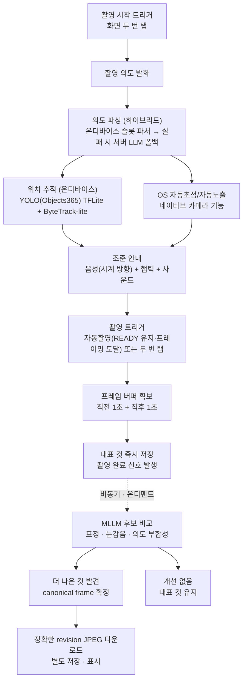

<div align="center">


**시각장애인을 위한 촬영 보조 APP**

</div>

AI camera assistant that helps blind and low-vision users frame and capture photos independently.

## 소개

보이지 않아도, 사진을 찍을 수 있다.

시각장애인도 우리가 일상에서 자주 사진을 찍는 것처럼 기록용 사진을 찍을 수 있어야 한다. 여행지에서 순간을 기록하고, 자녀의 성장 과정을 남기고, 나의 일상을 SNS에 공유하며 소통하는 경험은 시각 여부와 무관하게 누구에게나 필요하다.

카멜레ON은 음성으로 촬영 의도를 전달하면 AI가 피사체 위치를 추적해 햅틱·사운드 피드백으로 프레이밍을 안내하고, 촬영 시점 전후 프레임 중 가장 좋은 컷을 자동으로 골라주는 카메라 어시스턴트다.

## 핵심 아이디어

- **화면을 보지 않고 조작**: 화면 아무 곳 **두 번 탭(진행)·세 번 탭(보조)·길게 누르기(뒤로)** 탭 문법과 음성만으로 촬영 시작부터 셔터까지 가능 (볼륨 키는 시스템 볼륨 조절로 남겨둔다)
- **짧은 음성 + 비언어 피드백**: "한 시 방향으로 조금 회전해 주세요" 같은 짧은 확정 문구와 편차 기반 햅틱(가까울수록 빠른 진동)·earcon 으로 "지금 얼마나 잘 맞았는지"를 전달 — 긴 설명은 촬영 후에만
- **놓치지 않는 촬영**: 셔터 시점 전후 1초 버퍼 + 자동촬영 연사에서 가장 좋은 컷을 고름
- **역할 분리**: 실시간 처리(위치 추적, 프레이밍 판정, 자동초점/노출)는 온디바이스로 가볍게, 품질 판단(후보 비교·사진 설명)은 MLLM으로 비동기·온디맨드 처리
- **프라이버시**: 등록한 얼굴·사물 이름, 서류·신분증 사진과 본문, 민감 번호는 기기 밖으로 내보내지 않는다

## 전체 파이프라인



> 온디바이스 AI = YOLO 위치 추적 + ML Kit(포즈·얼굴·텍스트), 클라우드 AI = MLLM 후보 비교·설명 생성. 블러·노출·초점은 OS 네이티브 카메라 기능을 그대로 쓰고, 수평·원근·크롭 보정은 저장 직전에 앱이 처리한다.

## 단계별 설명

1. **촬영 시작 트리거** — 화면 아무 곳을 두 번 탭해 촬영 세션을 시작 (TalkBack의 클릭 액션도 같은 동작). 화면 전체가 하나의 버튼이라 위치를 찾을 필요가 없다.
2. **촬영 의도 발화** — 트리거 직후 사용자가 무엇을 찍고 싶은지 짧게 말함 (예: "앞에 있는 사람 찍어줘"). STT는 Android 내장 음성 인식을 쓴다.
3. **의도 파싱 (하이브리드, 1회)** — 온디바이스 규칙 기반 슬롯 파서(`SlotParser`)가 먼저 발화를 "타겟 스펙"(피사체 종류·프레이밍 등)으로 바꾸고, 신호가 안 잡힌 발화만 서버의 LLM 폴백으로 넘긴다. 스펙은 조준 구간의 온디바이스 처리에 전달됨.
4. **상태 기반 온디바이스 루프 (MLLM 미개입)**
   - **분석 모드**: 홈·결과·설정에서는 `OFF`, 발화 인식·파싱 중에는 analyzer를 떼고 빠른 재개만 준비하는 `WARM`, 조준·촬영·등록 중에만 `ACTIVE`
   - **위치 추적 (AI)**: detector는 `SEARCHING`/`LOCKED`/`LOST`와 열 상태에 따라 실행 주기를 조정하고, detector keyframe 사이 프레임은 tracker propagation으로 위치를 이어감
   - **자동초점/자동노출 (OS 네이티브)**: Android 기본 카메라 기능(Camera2/CameraX)을 그대로 활용 — 블러·노출·기울기는 여기서 처리
5. **조준 안내** — 편차를 룰 기반으로 판정해 짧은 확정 문구(좌우는 1~12시 시계 방향, 상하는 폰 기울이기, 수평은 좌우 돌리기)와 편차 기반 존재 진동(목표에 가까울수록 빠른 펄스)·earcon 으로 전달. 모드별 전용 안내(인물 자동 줌, 서류 잘림/반사 등)는 아래 "주요 기능" 참고.
6. **촬영 트리거** — 구도 READY 가 4초 유지되거나(지정 대상 세션) 인물·서류 프레이밍 목표에 도달하면 자동촬영. 화면 두 번 탭으로 수동 촬영도 언제든 가능.
7. **프레임 버퍼 확보 및 즉시 저장** — Android가 조준 중 PRE 333ms, 셔터 후 POST 200ms 간격으로 샘플링하되 제한된 장수만 보관하고, 셔터 전후 1초에서 최대 6개 후보를 고른다. 자동촬영은 3장 연사 후 가장 선명한 컷을 선택. 대표 컷은 MLLM을 기다리지 않고 즉시 저장(수평 보정·인물 3분할 크롭·서류 원근 보정 후처리 포함) → 이 시점에 촬영 완료 신호 발생.
8. **MLLM 후보 비교·통합 설명 (비동기, 온디맨드, 클라우드)** — 버퍼 후보를 대표 컷과 비교해 canonical frame을 먼저 확정한 뒤, 그 정확한 이미지 한 장에서 짧은 설명·상세 설명·검색 라벨을 함께 생성한다. 설정("서버 AI 사진 설명")으로 끌 수 있고, 서류·신분증 세션은 항상 업로드를 건너뛴다.
9. **결과 반영**
   - 더 나은 컷 발견 → 서버 revision과 frame ID를 검증해 canonical JPEG를 내려받고 MediaStore에 별도 저장·표시한 뒤 안내
   - 개선 없음 → 대표 컷 그대로 유지

## 주요 기능 — 발화로 전환되는 촬영 모드

| 모드 (발화 예) | 동작 |
|---|---|
| **인물** ("사람 찍어줘", "민수 찍어줘") | YOLO 추적 + ML Kit Pose(머리·발·골반)로 자동 줌·프레이밍, 목표 유지 시 자동촬영. "구도 좋게"류 발화는 큐레이션 사진 실측 분포 밴드로 프레이밍하고, 전신/상반신 선택 질문과 촬영 위치 확인("이대로 찍을까요?")을 거친다 |
| **사물** (Objects365 한글 라벨, 등록 이름) | 시계 방향 중앙 유도 + READY 4초 유지 자동촬영. 미지원 사물은 일반 촬영 모드로 안내 |
| **음식** ("케이크 찍어줘" 등) | 폰 각도를 45°로 유도한 뒤 구도 안내 |
| **풍경** ("풍경/경치") | 수평(roll)·역광 감지·장면 내용 낭독. 촬영은 수동 |
| **서류·신분증** ("서류/종이/신분증/영수증…") | 텍스트 영역+엣지 검출로 프레이밍(잘림·크기 자동 줌·위치·기울임·회전·반사 순 안내) → 정지 유지 자동촬영 → 원근 보정 → 촬영본 OCR 낭독·요약·금액/날짜/단어 찾기 음성 문답. 전 과정 온디바이스, 업로드 없음 |
| **셀카** (전면 전환 버튼) | 시선(카메라 응시) 판정을 통과해야 촬영 안내 |

그 밖의 기능:

- **등록**: 얼굴·사물을 이름으로 등록해 발화로 지정 촬영·검색 ("민수 나온 사진") — 정보는 기기에만 저장
- **사진 찾기(갤러리)**: 날짜·라벨·등록 인물 음성 검색, 사진 설명 낭독, 촬영 직후 텍스트 Q&A, 커스텀 라벨 붙이기
- **피드백 채널**: 프리셋 보이스(아리아·올리버 — SKT A.X TTS 프리캐싱 음원 + 즉석 합성) 또는 내장 TTS, 존재 확인 진동, 화면 전환 earcon, TalkBack 공존(촬영 세션 중에는 안내 발화 유지)
- **설정**: 진동 강도·사운드·음성 속도·안내 목소리·촬영 그리드·서버 AI 설명 — 터치와 음성 대화 양쪽으로 변경 가능

## 팀 구성 및 역할 분담

| 역할 | 맡는 파트 | 핵심 업무 |
|---|---|---|
| ① STT/NLU | 음성 → 타겟 스펙 | 클라우드 STT 연동, 의도 분류·슬롯 필링(세부 문장 의미 이해 모델 추가 가능) |
| ② 온디바이스 CV | 위치 추적 | 모델 선정·경량화, 추론 모듈(MediaPipe/YOLO-nano → TFLite) |
| ③ 백엔드 — 판정 로직 | 편차 계산 + 시스템 통합 | 위치 추적·타겟 스펙 비교(편차 계산), 서버 API/인프라, 팀 간 인터페이스 계약 관리 |
| ④ 백엔드 — 저장·MLLM | 업로드 프레임 저장 + MLLM 연동 | 대표·후보 저장, canonical frame 확정, 통합 설명 생성, MLLM 프롬프트 설계·API 호출·응답 파싱 |
| ⑤ Android — 카메라/센서 통합 | 트리거·네이티브 기능 + CV 모듈 통합 | 볼륨 버튼 트리거, Camera2/CameraX 연동, bounded 링 버퍼, 오디오 캡처, 자동초점/노출, ②의 TFLite 모듈 통합·호출 |
| ⑥ Android — UX/피드백 | 접근성 UI + 햅틱·사운드 렌더링 | 온보딩·화면 설계, TalkBack 호환성, 편차 신호를 실제 진동·사운드 패턴으로 변환 |

①과 ②는 각각 "클라우드 API 모듈"과 "온디바이스 추론 모듈"을 만드는 담당이고, ③④와 ⑤⑥은 그 모듈들을 자기 프로세스(백엔드/Android 앱) 안에 통합·오케스트레이션하는 담당이다 — ①의 산출물은 ③이 관리하는 백엔드 프로세스 안에서, ②의 산출물은 ⑤가 관리하는 Android 프로세스 안에서 실행된다.

> **구현 확정**: 롤링 버퍼는 ⑤(Android)가 로컬에서 제한된 크기로 보유한다. 조준·촬영 상태에서만 후보를 샘플링하고, 셔터 전후에서 고른 최대 6장만 대표 컷과 함께 ④(백엔드)로 전송한다. 카메라 프레임을 상시 스트리밍하지 않는다.

## 설계 원칙

- **온디바이스 vs 클라우드 분리**: 조준 중 위치 추적과 자동초점/노출은 지연 없이 온디바이스에서 실행하고, 품질 판단(MLLM)만 비동기·온디맨드로 클라우드에 위임한다.
- **먼저 저장, 나중에 개선**: 촬영 완료는 MLLM 응답을 기다리지 않는다. 대표 컷을 즉시 저장해 사용자 경험을 끊지 않고, 더 나은 컷은 사후에 revision을 검증해 별도 저장·표시한다.
- **네이티브 우선**: 노출, 자동초점처럼 OS가 이미 잘 처리하는 기능은 직접 구현하지 않고 Android 네이티브 카메라 기능(CameraX)을 그대로 활용한다. 수평·원근·크롭 등 구도 후처리는 저장 직전에 앱이 보정한다.
- **짧은 확정 문구 + 비언어 신호**: 실시간 피드백은 한 번에 한 축, 짧은 확정 문구(프리캐싱 음원과 1:1)로 말하고, 연속 상태는 햅틱·earcon 이 맡는다. 긴 설명(사진 내용 등)은 촬영이 끝난 뒤에만 낭독한다.
- **프라이버시**: 등록 이름은 발화·업로드에서 가려지고(기기 안 매핑만 보유), 서류·신분증 세션은 사진·본문을 서버로 보내지 않으며 민감 번호는 낭독 전에 마스킹한다.

## 기술 스택

- **백엔드**: Python, FastAPI, uvicorn
- **온디바이스 위치 추적**: YOLO(Objects365 365-class) TFLite + ByteTrack-lite 트래커 (PC 참조 구현은 `ai/on_device_cv`)
- **온디바이스 인식 (ML Kit)**: Pose(인물 프레이밍 머리·발·골반), Face(셀카 시선·인물 크롭·얼굴 등록), 한국어 Text Recognition(서류 모드)
- **MLLM 연동**: Anthropic API
- **음성**: Android SpeechRecognizer(STT), 내장 TTS + SKT A.X TTS 프리셋 보이스(백엔드 프록시·프리캐싱 음원)
- **이미지 처리**: Pillow (백엔드)
- **모바일**: Android 네이티브 (Kotlin, Jetpack Compose, CameraX, TFLite 런타임, TalkBack 접근성 대응)

의존성 전체 목록은 [requirements.txt](requirements.txt) 참고.

## 폴더 구조

```
backend/                     # ③④ 공유 백엔드 (FastAPI)
├── main.py                   # 앱 엔트리포인트
├── config.py                  # 환경변수 로드, 앱 설정값
├── api/                       # 라우터 (엔드포인트)
│   ├── session.py              # 세션 발화 → 타겟 스펙 (LLM 폴백 포함)
│   ├── capture.py              # 대표·후보 프레임 업로드, canonical/설명 폴링
│   ├── labels.py               # 검색용 사진 라벨 사전
│   ├── text_qa.py              # 촬영 사진 텍스트 Q&A
│   ├── tts.py                  # SKT A.X TTS 프록시 (프리셋 보이스 즉석 합성)
│   └── guards.py               # API 접근 가드
├── judgment/deviation.py      # ③ bbox vs 타겟 스펙 편차 계산 (Kotlin 이식의 원본 계약)
├── storage/                   # ④ 대표 컷 · 후보 · 비교 결과 저장
├── mllm/                      # ④ MLLM 연동 — 후보 비교(orchestration), 설명·메타데이터 생성, 프롬프트
└── utils/logger.py

ai/                           # ①② 파이썬 참조 구현 (앱 Kotlin 코드와 미러)
├── slot_parser.py              # 규칙 기반 의도 파싱 (cv/SlotParser.kt 와 1:1)
├── llm_fallback.py             # 못 알아들은 발화의 LLM 폴백
├── followup_parser.py          # 결과 화면 후속 발화 파싱
├── text_qa.py / photo_labels.py / label_normalizer.py
├── skt_tts_client.py           # SKT A.X TTS 클라이언트
├── target_spec.py              # TargetSpec 계약 validator
├── taxonomy/                   # Objects365 365-class 고정 taxonomy
├── on_device_cv/               # PC 참조 구현 (detector·tracker·pipeline·demo)
└── tools/                      # export_tflite, composition_stats(구도 분포 추출), 벤치마크 등

frontend/                     # ⑤⑥ Android 네이티브 앱 (Kotlin, Compose)
└── app/src/main/
    ├── java/com/example/snap_sight/
    │   ├── MainActivity.kt       # 화면·세션·판정 오케스트레이션
    │   ├── camera/               # CameraX, 링 버퍼, 연사 선택, 센서, 수평/원근 보정, 인물 크롭
    │   ├── cv/                   # YOLO TFLite + ByteTrack-lite + 타겟 선택·편차·READY 판정
    │   ├── face/                 # ML Kit — 인물 포즈, 셀카 시선, 얼굴·사물 등록 식별
    │   ├── document/             # 서류 모드 — 텍스트 관측·엣지 검출·OCR·원근 보정
    │   ├── stt/                  # 음성 인식 래퍼
    │   ├── search/               # 사진 찾기 검색 엔진·인덱스
    │   ├── network/              # 백엔드 API 클라이언트
    │   ├── privacy/              # 등록 이름 가림 (서버 전송 전 치환)
    │   ├── metrics/              # 세션 지연 측정
    │   └── ux/                   # 화면(Compose)·탭 문법·안내 정책(GuidancePolicy)·TTS/햅틱 렌더링
    └── assets/                  # .tflite 모델 + 라벨, 프리셋 보이스 프리캐싱 음원(tts/aria·oliver)

tests/                        # pytest — 백엔드 + ai 참조 구현 + Kotlin 미러 계약 검증
```

> iOS는 6인 역할표가 Android 전용으로 확정되면서 폴더 구조에서 뺐다. 다시 포함하기로 하면 `ios/`를 추가하고 이 문서의 "Android" 표기를 되돌릴 것.

## 설치 및 실행

### On-device CV 프로토타입

Objects365 365-class YOLO nano detector와 multi-object tracker를 분리한 PC용 구현은
[`ai/on_device_cv`](ai/on_device_cv/README.md)에 있습니다. 영상 또는 웹캠에서 지원
객체 전체를 탐지하고 normalized bbox, confidence, 지속적인 `track_id`를 반환합니다.

```powershell
python -m ai.on_device_cv --source .\sample.mp4
```

### 백엔드 (Python)

```bash
python -m venv .venv
source .venv/bin/activate
pip install -r requirements.txt
```

MLLM 연동을 위해 Anthropic API 키가 필요하다. 저장소 루트에 `.env` 파일을 만들고 `.env.example`을 참고해 아래처럼 채운다.

```
ANTHROPIC_API_KEY=your_api_key_here
```

서버 실행:

```bash
uvicorn backend.main:app --reload
```

기본적으로 `http://127.0.0.1:8000`에서 실행되며, `POST /api/capture/frames`로 대표 컷·후보 프레임을 업로드할 수 있다. `.env`가 없거나 `ANTHROPIC_API_KEY`가 비어 있으면 서버 기동 시 명확한 에러 메시지와 함께 종료된다.

실기기에서 접속하는 방법과 결과 조회 폴링 정책은 [docs/backend-local-setup.md](docs/backend-local-setup.md) 참고.

### 모바일 앱 (Android)

Android 프로젝트는 `frontend/`에 있다. Android Studio로 열거나 CLI로 빌드한다.

```powershell
cd frontend
.\gradlew.bat :app:assembleDebug
```

②의 온디바이스 CV 모듈은 `frontend/app/src/main/java/com/example/snap_sight/cv/`에 포팅되어
CameraX 프레임 스트림에 연결돼 있다. 연결 방법과 확장 지점은
[docs/android-cv-module.md](docs/android-cv-module.md) 참고. TFLite 모델은 별도로 생성해야 한다.

```powershell
python -m pip install "ultralytics" tensorflow
python -m ai.tools.export_tflite
```

모델 자산이 없어도 앱은 정상 기동하며, CV 결과만 비어 있는 상태로 동작한다.

## 라이선스

[MIT](LICENSE)
