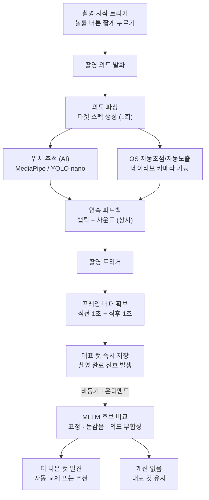

# Snap-Sight

AI camera assistant that helps blind and low-vision users frame and capture photos independently.

## 소개

보이지 않아도, 사진을 찍을 수 있다.

시각장애인도 우리가 일상에서 자주 사진을 찍는 것처럼 기록용 사진을 찍을 수 있어야 한다. 여행지에서 순간을 기록하고, 자녀의 성장 과정을 남기고, 나의 일상을 SNS에 공유하며 소통하는 경험은 시각 여부와 무관하게 누구에게나 필요하다.

Snap-Sight는 음성으로 촬영 의도를 전달하면 AI가 피사체 위치를 추적해 햅틱·사운드 피드백으로 프레이밍을 안내하고, 촬영 시점 전후 프레임 중 가장 좋은 컷을 자동으로 골라주는 카메라 어시스턴트다.

## 핵심 아이디어

- **화면을 보지 않고 조작**: 볼륨 버튼과 음성만으로 촬영 시작부터 셔터까지 가능
- **연속적인 비언어 피드백**: 문장이 아닌 햅틱 진동 + 사운드로 "지금 얼마나 잘 맞았는지"를 끊김 없이 전달
- **놓치지 않는 촬영**: 셔터 시점 전후 1초 버퍼를 확보해, 순간이 어긋나도 더 나은 프레임을 사후에 찾아줌
- **역할 분리**: 실시간 처리(위치 추적, 자동초점/노출)는 온디바이스로 가볍게, 품질 판단(표정·구도 검증)은 MLLM으로 비동기·온디맨드 처리

## 전체 파이프라인



> AI 처리 범위 = 위치 추적, MLLM 검증만. 블러·노출·기울기 보정은 OS 네이티브 카메라 기능을 그대로 사용한다.

## 단계별 설명

1. **촬영 시작 트리거** — 사용자가 볼륨 버튼을 짧게 눌러 촬영 세션을 시작. 화면을 보지 않아도 접근 가능한 물리 버튼을 사용.
2. **촬영 의도 발화** — 트리거 직후 사용자가 무엇을 찍고 싶은지 짧게 말함 (예: "인물 사진 찍어줘").
3. **의도 파싱 (1회)** — STT로 텍스트화한 발화를 파싱해 "타겟 스펙"(피사체 종류 등)을 한 번 생성. 이후 상시 루프 전체에 전달됨.
4. **상시 루프 (매 프레임, MLLM 미개입)**
   - **위치 추적 (AI)**: MediaPipe/YOLO-nano로 피사체 위치·크기를 온디바이스에서 검출
   - **자동초점/자동노출 (OS 네이티브)**: Android 기본 카메라 기능(Camera2/CameraX)을 그대로 활용 — 블러·노출·기울기는 여기서 처리
5. **연속 피드백** — 위치 추적 결과와 타겟 스펙의 편차를 룰 기반으로 판정해 햅틱 진동 + 사운드로 상시 전달. 문장이 아닌 신호로 표현해 끊김 없이 조준을 조정할 수 있게 함.
6. **촬영 트리거** — 사용자가 셔터를 누르거나 음성으로 촬영을 요청.
7. **프레임 버퍼 확보 및 즉시 저장** — 촬영 시점 직전 1초 + 직후 1초 프레임을 버퍼로 확보. 대표 컷은 MLLM을 기다리지 않고 즉시 저장 → 이 시점에 촬영 완료 신호 발생, 세션 종료.
8. **MLLM 후보 비교 (비동기, 온디맨드, 클라우드)** — 저장 이후 별도로, 버퍼 내 후보 프레임들을 대표 컷과 비교해 표정·눈감음·의도 부합성 기준으로 더 나은 컷이 있는지 판단.
9. **결과 반영**
   - 더 나은 컷 발견 → 자동 교체 또는 "촬영 순간 근처에서 더 나은 사진을 찾았어요" 추천
   - 개선 없음 → 대표 컷 그대로 유지

## 팀 구성 및 역할 분담

| 역할 | 맡는 파트 | 핵심 업무 |
|---|---|---|
| ① STT/NLU | 음성 → 타겟 스펙 | 클라우드 STT 연동, 의도 분류·슬롯 필링(세부 문장 의미 이해 모델 추가 가능) |
| ② 온디바이스 CV | 위치 추적 | 모델 선정·경량화, 추론 모듈(MediaPipe/YOLO-nano → TFLite) |
| ③ 백엔드 — 판정 로직 | 편차 계산 + 시스템 통합 | 위치 추적·타겟 스펙 비교(편차 계산), 서버 API/인프라, 팀 간 인터페이스 계약 관리 |
| ④ 백엔드 — 저장·MLLM | 프레임 버퍼·저장 + MLLM 연동 | 버퍼 관리, 대표 컷 저장, MLLM 프롬프트 설계·API 호출·응답 파싱 |
| ⑤ Android — 카메라/센서 통합 | 트리거·네이티브 기능 + CV 모듈 통합 | 볼륨 버튼 트리거, Camera2/CameraX 연동, 오디오 캡처(마이크 녹음 → 백엔드 전달), 자동초점/노출, ②의 TFLite 모듈 통합·호출 |
| ⑥ Android — UX/피드백 | 접근성 UI + 햅틱·사운드 렌더링 | 온보딩·화면 설계, TalkBack 호환성, 편차 신호를 실제 진동·사운드 패턴으로 변환 |

①과 ②는 각각 "클라우드 API 모듈"과 "온디바이스 추론 모듈"을 만드는 담당이고, ③④와 ⑤⑥은 그 모듈들을 자기 프로세스(백엔드/Android 앱) 안에 통합·오케스트레이션하는 담당이다 — ①의 산출물은 ③이 관리하는 백엔드 프로세스 안에서, ②의 산출물은 ⑤가 관리하는 Android 프로세스 안에서 실행된다.

> **미해결**: 촬영 시점 전후(직전 1초 + 직후 1초) 프레임 롤링 버퍼는 카메라 프레임이 실시간으로 발생하는 ⑤(온디바이스) 쪽에서 들고 있어야 실현 가능하다 — 매 프레임을 백엔드로 스트리밍하는 건 대역폭상 비현실적이다. 위 표는 팀이 정한 원안(④=버퍼 관리)을 그대로 두었지만, 구현 전에 "⑤가 롤링 버퍼 보유 → 셔터 시점에 필요한 프레임만 ④로 전송 → ④는 저장만 담당"으로 재확인이 필요하다.

## 설계 원칙

- **온디바이스 vs 클라우드 분리**: 상시 루프(위치 추적, 자동초점/노출)는 지연 없이 온디바이스에서 실행하고, 품질 판단(MLLM)만 비동기·온디맨드로 클라우드에 위임한다.
- **먼저 저장, 나중에 개선**: 촬영 완료는 MLLM 응답을 기다리지 않는다. 대표 컷을 즉시 저장해 사용자 경험을 끊지 않고, 더 나은 컷은 사후에 조용히 교체·추천한다.
- **네이티브 우선**: 블러 보정, 노출, 자동초점처럼 OS가 이미 잘 처리하는 기능은 직접 구현하지 않고 Android 네이티브 카메라 기능(Camera2/CameraX)을 그대로 활용한다.
- **비언어 피드백**: 화면을 보지 않는 사용자를 위해 모든 실시간 피드백은 문장이 아닌 햅틱·사운드 신호로 전달한다.

## 기술 스택

- **백엔드**: Python, FastAPI, uvicorn
- **컴퓨터 비전 / 온디바이스 위치 추적**: OpenCV, MediaPipe, NumPy
- **MLLM 연동**: Anthropic API (Claude)
- **이미지 처리**: Pillow
- **모바일**: Android 네이티브 (Camera2/CameraX, TFLite 런타임 통합, TalkBack 접근성 대응)

의존성 전체 목록은 [requirements.txt](requirements.txt) 참고.

## 폴더 구조

현재 구현과 향후 확장 위치는 다음과 같다. 아직 만들지 않은 모듈은 예정 구조다.

```
backend/                     # ③④ 공유 백엔드 (FastAPI)
├── main.py                   # 앱 엔트리포인트
├── config.py                  # 환경변수 로드, 앱 설정값
├── api/                       # 라우터 (엔드포인트)
│   ├── session.py              # 세션 시작 · 타겟 스펙
│   ├── tracking.py             # ⑤→③ bbox 수신 → 편차 계산 트리거
│   └── capture.py              # 촬영 트리거 · 프레임 저장
├── stt_nlu/                   # ① STT/NLU 모듈
│   ├── stt_client.py            # 클라우드 STT 연동
│   └── intent_parser.py         # 의도 분류 · 슬롯 필링 → 타겟 스펙
├── judgment/                  # ③ 판정 로직
│   └── deviation.py             # bbox vs 타겟 스펙 편차 계산
├── storage/                   # ④ 저장
│   ├── frame_buffer.py          # 대표 컷 · 후보 프레임 저장
│   └── models.py                # DB 스키마 (필요 시)
├── mllm/                      # ④ MLLM 연동
│   ├── prompts.py               # 프롬프트 템플릿
│   └── client.py                # Claude API 호출 · 응답 파싱
└── utils/
    └── logger.py

ai/                           # ② 온디바이스 CV
├── on_device_cv/               # PC 참조 구현 (Python)
│   ├── contracts.py             # normalized bbox·공개 JSON 계약
│   ├── detectors/               # 교체 가능한 detector adapter
│   ├── trackers/                # multi-object tracker
│   ├── extensions.py            # 향후 person→face 확장 hook
│   ├── pipeline.py              # 모델 독립 처리 pipeline
│   └── demo.py                  # 영상·웹캠 PC prototype
├── target_spec.py              # ① TargetSpec 계약 validator
├── taxonomy/                   # Objects365 365-class 고정 taxonomy
└── tools/export_tflite.py      # .pt → Android assets 용 .tflite export

frontend/                     # ⑤⑥ Android 네이티브 앱
└── app/src/main/
    ├── java/com/example/snap_sight/
    │   ├── camera/               # ⑤ CameraX, 트리거, 링 버퍼, 센서
    │   ├── cv/                   # ② 온디바이스 CV (Kotlin 포팅) + ⑤ 프레임 계약
    │   │   ├── Contracts.kt       # 공개 JSON 계약 (Python contracts.py 와 1:1)
    │   │   ├── TfLiteYoloDetector.kt  # TFLite 에 의존하는 유일한 파일
    │   │   ├── ByteTrackLiteTracker.kt
    │   │   ├── TargetSelector.kt  # 의도 기반 후보 선택 (target_selection.py 포팅)
    │   │   ├── Deviation.kt       # 편차 계산 확장 자리 (현재 no-op)
    │   │   └── SnapSightFrameProcessor.kt  # CameraX 진입점
    │   ├── network/              # ⑤ 백엔드 API 클라이언트
    │   └── ux/                   # ⑥ 접근성 UI, TalkBack, 햅틱·사운드
    ├── res/                     # 레이아웃 · 리소스
    └── assets/                  # ②가 export 한 .tflite 모델 + 라벨

tests/                        # pytest
├── test_capture.py
├── test_cv_contracts.py
├── test_cv_demo.py
├── test_cv_tracker.py
├── test_cv_pipeline.py
├── test_cv_visualization.py
└── test_ultralytics_detector.py
```

> iOS는 6인 역할표가 Android 전용으로 확정되면서 폴더 구조에서 뺐다. 다시 포함하기로 하면 `ios/`를 추가하고 이 문서와 CLAUDE.md의 "Android" 표기를 되돌릴 것.

## 설치 및 실행

### On-device CV 프로토타입

Objects365 365-class YOLO nano detector와 multi-object tracker를 분리한 PC용 구현은
[`ai/on_device_cv`](ai/on_device_cv/README.md)에 있습니다. 영상 또는 웹캠에서 지원
객체 전체를 탐지하고 normalized bbox, confidence, 지속적인 `track_id`를 반환합니다.

```powershell
python -m ai.on_device_cv --source .\sample.mp4
```

### 백엔드 (Python)

```bash
python -m venv .venv
source .venv/bin/activate
pip install -r requirements.txt
```

MLLM(Claude) 연동을 위해 Anthropic API 키가 필요하다. 저장소 루트에 `.env` 파일을 만들고 `.env.example`을 참고해 아래처럼 채운다.

```
ANTHROPIC_API_KEY=your_api_key_here
```

서버 실행:

```bash
uvicorn backend.main:app --reload
```

기본적으로 `http://127.0.0.1:8000`에서 실행되며, `POST /api/capture/frames`로 대표 컷·후보 프레임을 업로드할 수 있다. `.env`가 없거나 `ANTHROPIC_API_KEY`가 비어 있으면 서버 기동 시 명확한 에러 메시지와 함께 종료된다.

### 모바일 앱 (Android)

Android 프로젝트는 `frontend/`에 있다. Android Studio로 열거나 CLI로 빌드한다.

```powershell
cd frontend
.\gradlew.bat :app:assembleDebug
```

②의 온디바이스 CV 모듈은 `frontend/app/src/main/java/com/example/snap_sight/cv/`에 포팅되어
CameraX 프레임 스트림에 연결돼 있다. 연결 방법과 확장 지점은
[docs/android-cv-module.md](docs/android-cv-module.md) 참고. TFLite 모델은 별도로 생성해야 한다.

```powershell
python -m pip install "ultralytics" tensorflow
python -m ai.tools.export_tflite
```

모델 자산이 없어도 앱은 정상 기동하며, CV 결과만 비어 있는 상태로 동작한다.

## 개발 가이드

코드 작성 규칙, 아키텍처 제약(온디바이스 vs 클라우드 분리 등), 팀 간 인터페이스 계약(데이터 포맷)은 [CLAUDE.md](CLAUDE.md)에 정리되어 있다. 새로 합류했다면 먼저 확인할 것.

## 라이선스

[MIT](LICENSE)
