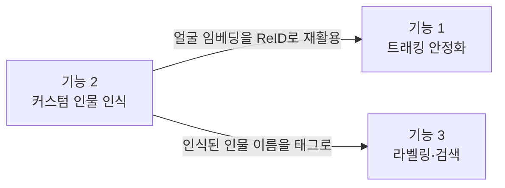

# Snap-Sight 확장 기능 기획 (트래킹 안정화 · 커스텀 인물 인식 · 라벨 기반 사진 검색)

> **구현 현황 (2026-08-21)** — 1차 구현 완료. 자세한 매핑은 문서 끝 "구현 현황" 절 참고.
> 실기기 검증이 필요한 항목: 자이로 모션 보정 부호(`CameraMotionEstimator.ENABLED`, 기본 OFF),
> 얼굴 임베더 모델 자산 배치(`assets/face_embedder.tflite`), 얼굴 유사도 임계값 리허설 튜닝.

> 이 문서는 3개 확장 기능의 **결정 사항과 구조**를 기록한다. 데모 시연에서 잘 동작하는 것이
> 목표이며, 상용 수준의 엄밀함은 범위 밖이다.
>
> **수정 가이드**: 각 항목에는 상태 표시가 있다 — ✅ 확정 / 🔶 조정 가능(기본값 있음) / ❓ 미정.
> 조정 가능한 값(임계값 등)은 본문에 흩어두지 않고 각 기능 끝의 **파라미터 표**에 모아뒀다.
> 값이나 방침이 바뀌면 해당 표와 상태 표시만 고치면 된다.

## 기능 간 의존 관계



- 기능 1과 기능 3은 서로 독립 — 병렬 진행 가능.
- 기능 2의 얼굴 모듈은 기능 1(재식별)과 기능 3(인물 검색)이 모두 재사용하므로 독립 모듈로 먼저 격리해 만든다.

---

## 기능 1. 트래킹 안정화

### 문제 진단 ✅

현재 `ByteTrackLiteTracker`(Kotlin/Python 동일 계약)는 IoU만으로 프레임 간 연결을 한다.
끊김의 주요 원인 (추정 기여 순):

| # | 원인 | 근거 |
|---|---|---|
| 1 | 카메라 전역 이동이 큼 — 화면을 못 보는 사용자가 카메라를 휘저으며 조준 | 앱 특성상 구조적 |
| 2 | 분석 FPS가 낮으면 프레임 간 이동량 증가, `lostTrackBuffer=30`(프레임 단위)의 실제 유지 시간 단축 | 성능 로그로 확인 가능 |
| 3 | YOLO nano confidence 깜빡임 | 저신뢰 복구 단계로도 못 살리는 케이스 |
| 4 | 외형(appearance) 정보 부재 — 가려짐 후 재등장 시 동일성 판단 불가 | 구조적 |

### 개선 항목 (착수 순서대로)

| 순서 | 항목 | 상태 | 내용 |
|---|---|---|---|
| 1-A | 지표 측정 | ✅ | 세션당 ID 교체 횟수, 분당 타겟 상실 시간을 기존 `SnapSightCV` 성능 로그에 추가. 실기기 녹화 세션을 확보해 Python 참조 구현으로 오프라인 재현·튜닝 |
| 1-B | 타겟 락 레이어 | ✅ | 조준 중 필요한 건 전체 track_id가 아니라 **선택된 타겟 하나의 연속성**. `SpecDeviationCalculator`가 기억하는 track이 끊기면, 같은 라벨 + 유사 위치·크기의 새 track을 N프레임 내에서 같은 타겟으로 재획득. 사용자 경험상 LOST 없이 이어짐 |
| 1-C | 센서 모션 보상 | ✅ | `TiltSensorMonitor` 확장 — 자이로/회전 벡터로 프레임 간 카메라 회전량을 얻어 예측 bbox를 이동시킨 뒤 매칭. CV 연산 추가 없음 |
| 1-D | 매칭 완화 | 🔶 | IoU에 중심 거리 비용 혼합(DIoU 유사), 경과 시간 비례 예측 bbox 확장, `lostTrackBuffer`를 초 단위로 변경. Kotlin·Python 양쪽 동일 반영 |
| 1-E | 얼굴 ReID | 🔶 | 기능 2의 임베딩 재활용 — 인물 타겟 track 상실 후 재등장 시 임베딩 유사도로 동일인 확인. 기능 2 완성 후 |

### 파라미터 표 (기능 1)

| 파라미터 | 기본값 | 비고 |
|---|---|---|
| 타겟 락 재획득 허용 프레임 | ❓ 측정 후 결정 | 1-A 지표 확보 후 |
| 타겟 락 위치·크기 허용 오차 | ❓ 측정 후 결정 | 〃 |
| lostTrackBuffer (초 단위 전환 시) | 🔶 2초 | 〃 |

---

## 기능 2. 커스텀 인물 인식 (온디바이스 얼굴 벡터 DB)

### 방침 ✅

- **데모 최적화**: 엄밀한 캘리브레이션 대신 **샘플 물량 + 현장 재등록**으로 시연 성공률을 확보한다.
- **얼굴 임베딩·이름은 기기 밖으로 절대 내보내지 않는다.** 이미지 자체는 동의 기반으로 정리됨.
- 벡터 DB는 별도 솔루션 없이 **Room(SQLite) BLOB + 전수 cosine 비교** (등록 인원 2~3명 × 인당 수십 벡터 → 1ms 미만).

### 파이프라인 ✅

```
YOLO person bbox → 얼굴 검출 (ML Kit, bbox 내부만) → 크롭·정렬
→ 임베딩 (MobileFaceNet 계열 TFLite) → Room의 인물별 벡터와 cosine 비교 → 판정
```

- TFLite 의존은 파일 하나에 격리 (`TfLiteYoloDetector` 원칙과 동일) — `cv/FaceEmbedder.kt`.
- **실행 빈도**: 매 프레임이 아니라, 신원 미확인 person track에 대해서만 K프레임 간격으로 시도.
  확인되면 track_id에 이름을 바인딩하고 track 생존 중 재계산하지 않는다. track 상실 → 재등장 시 재확인 (= 기능 1-E).

### 등록(enrollment) ✅

- 설정 내 "가족·지인 등록" 화면: 2~3초 카메라를 비추는 동안 **프레임 20~30장 자동 샘플링 → 전부 임베딩 저장**. 등록 대상은 고개를 천천히 좌우로 돌리도록 음성 안내 (각도 다양성 자동 확보).
- 같은 사람을 다른 조명·장소에서 **누적 등록** 가능. 이름은 음성 입력. 인물별 삭제 지원.
- 등록 첫 진입 시 동의 확인 1회 (음성+화면): "이 분의 동의를 받았나요? 얼굴 정보는 이 기기에만 저장됩니다."
- **시연 체크리스트**: 시연 장소 도착 후 현장 조명에서 재등록 1회 (30초 소요, 임계값 튜닝보다 확실한 보험).

### 판정 규칙 ✅

두 조건 AND — 오인식 1번이 미인식 10번보다 치명적이므로 보수적으로. 애매하면 침묵.

1. 후보 임베딩 vs 인물별 전체 벡터 중 **상위 k개 유사도 평균** ≥ 임계값
2. 1위 인물과 2위 인물의 점수 차 ≥ 마진 (데모 인원끼리 혼동 방지)

### 발화 연동 ✅

- "우리 아들 찍어줘" → 호칭↔등록 이름 매칭은 **온디바이스**에서 처리 (이름이 서버로 안 감).
- TargetSpec에 `person_name` 슬롯 추가 (스키마 0.2 → 0.3). 조준 중 안내: "민수님을 찾았어요."

### 파라미터 표 (기능 2) — 시연 전 리허설에서 조정, 상수 파일 한 곳에 모음

| 파라미터 | 기본값 | 비고 |
|---|---|---|
| cosine 유사도 임계값 | 🔶 0.5 | 데모 인원 기준으로 1회 조정 |
| 1위-2위 마진 | 🔶 0.1 | 〃 |
| top-k (유사도 평균) | 🔶 5 | |
| 등록 샘플 수 (1회 등록당) | 🔶 20~30장 | |
| 임베딩 시도 간격 K | 🔶 10프레임 | 성능 예산 보고 조정 |

---

## 기능 3. 상세 설명·라벨링 + 대화형 갤러리 검색

### 핵심 구조 ✅ — 두 개의 라벨 사전

라벨링(사진에 붙이는 쪽)과 검색(발화를 해석하는 쪽)이 **같은 사전을 공유하는 폐쇄형(closed-set)** 설계.
LLM 자유 태그를 쓰지 않는 이유: "케익/케이크/디저트"가 제각각 태그가 되면 검색 매칭이 확률적이 된다.
사전에서 고르게 하면 검색이 결정적으로 동작한다.

| | 사전 1: 고정 라벨 사전 | 사전 2: 사용자 커스텀 사전 |
|---|---|---|
| 소유 | 기획팀 | 사용자 (기기 로컬) |
| 저장 위치 | 앱 배포 파일 `photo_labels.json` (버전 관리) | Room DB |
| 생성 방법 | 기획팀이 정의·수정 | 음성: "이 사진 '제주도 여행'으로 기억해줘" |
| synonyms | 있음 (아래 참고) | 없이 시작 — 이름 정확 매칭만. 별칭 추가는 후순위 ❓ |
| 자동 라벨링에 사용 | O | O — 라벨링 요청 시 앱이 커스텀 라벨 목록을 함께 전송, LLM은 두 사전의 합집합에서 선택. 단 **인물 이름 라벨은 예외** — 서버로 보내지 않고 로컬에서 병합 |
| 검색에 사용 | O | O — 검색 시 두 사전을 구분 없이 통합 매칭 (사용자에게는 사전이 하나로 보임) |

> **synonyms란**: 같은 라벨을 사용자가 실제로 부를 법한 다른 말 목록. 사진에는 라벨
> `음식` 하나만 붙지만, 검색 발화의 "먹을 거"·"밥"·"요리"가 전부 이 라벨로 번역돼 매칭된다.
> 라벨링 어휘와 음성 검색 어휘를 미리 이어두는 장치.

#### 고정 사전 파일 형식 ✅

```json
{
  "version": 1,
  "labels": [
    {"id": "food",     "name": "음식",  "synonyms": ["먹을 거", "밥", "요리", "메뉴", "식사"]},
    {"id": "birthday", "name": "생일",  "synonyms": ["생파", "축하"]},
    {"id": "outdoor",  "name": "야외",  "synonyms": ["바깥", "밖에서"]}
  ]
}
```

- 실제 라벨 목록은 ❓ **기획팀 정의 중**. 라벨마다 synonyms("사용자가 이걸 뭐라고 말할까")를 함께 정의해달라고 요청해둔 상태. 확정 전에는 위와 같은 샘플 사전으로 개발 진행.
- 리스트 수정 = 파일 수정, 코드 변경 없음. 사진 레코드마다 `taxonomy_version`을 저장해두고, 버전이 올라가면 옛 사진을 백그라운드 재라벨링 (지연 허용이 방침이므로 문제없음).

### 메타데이터 생성 (백엔드, 비동기 — 느려도 되니 정확하게) ✅

업로드 후 기존 2문장 설명과 별개로 2단계 생성:

1. **상세 설명 (long_desc)** — 대표 컷의 낭독용 상세 문단 (인물 표정·옷차림·배경·분위기). 지연 허용이므로 상위 모델 사용 가능.
2. **라벨 선택** — [고정 사전 전체 + 앱이 보낸 커스텀 라벨 목록 + 셔터 시점 CV 탐지 결과 + 발화 원문]을 주고 "이 리스트에서만 골라라". pydantic 검증으로 리스트 밖 라벨 거부·재시도 (기존 `mllm/prompts.py` 스키마 검증 패턴 재사용).

**필수 메타데이터는 LLM과 무관하게 별도 저장** — LLM이 실패해도 시간·장소 검색은 항상 동작:

| 필드 | 출처 | 상태 |
|---|---|---|
| taken_at | 촬영 시각 (MediaStore와 동일) | ✅ 필수 |
| location_text | 셔터 시점 GPS → Geocoder 역지오코딩 ("서울 강남구" 수준) | ✅ 필수 · 위치 권한 추가 필요 |
| people | 온디바이스 인식 인물 이름 | ✅ 로컬 전용, 서버 안 거침 |

백엔드 저장은 현행대로 **세션 폴더에 JSON 파일**(`metadata.json`) — description.json 패턴과 동일.
서버 DB 신설은 데모 범위에서 이득이 없고, 검색이 실제로 도는 곳은 앱 로컬 DB다. ✅

### 앱 로컬 인덱스 ✅ — Room `photo_index`

| 컬럼 | 내용 |
|---|---|
| session_id | 파일명에서 추출 (기존 `sessionIdFromDisplayName` 재사용) |
| uri, taken_at, location_text | 필수 메타데이터 |
| fixed_labels | 고정 사전 라벨 id 배열 |
| custom_labels | 커스텀 사전 라벨 id 배열 |
| label_source | 라벨별 `auto`(LLM 부착) / `user`(사용자 직접 부착) |
| people | 인식된 인물 이름 (로컬 전용) |
| short_desc, long_desc | 설명 (long_desc는 FTS 인덱스) |
| taxonomy_version | 재라벨링 판단용 |

- fixed/custom을 분리하고 label_source를 두는 이유: 고정 사전 버전업 재라벨링 시 **auto로 붙은 fixed_labels만 갱신**하고, 사용자가 직접 붙인 라벨은 건드리지 않기 위함.
- 메타데이터 폴링 완료 시 기록 → 이후 **검색은 완전 오프라인 동작**. 메타데이터 없는 옛 사진은 갤러리 진입 시 백그라운드 backfill.

### 검색 UX (점진 필터링, 음성 우선) ✅

1. **발화**: "지난주에 찍은 음식 사진 찾아줘"
2. **질의 파싱 (온디바이스 규칙 우선)**:
   - 시간 표현 (어제/지난주/8월) → taken_at 범위
   - 장소 단어 → location_text 매칭
   - 인물 호칭 → people 매칭
   - 나머지 키워드 → [고정 사전 name+synonyms] ∪ [커스텀 라벨 name] 통합 매칭
   - 사전에 없는 단어만 long_desc FTS 폴백. 규칙으로 해석 실패 시 백엔드 LLM 폴백 ❓ (발화→타겟 스펙과 같은 패턴, 필요성 확인 후)
3. **결과 낭독**: "3장을 찾았어요. 첫 번째, 8월 15일, …"
4. **점진 좁히기**: 결과가 기준(🔶 8장) 초과면 좁히는 질문 → 후속 발화는 **필터 스택에 AND 누적** ("그중에 민수 나온 거") → "처음부터 다시" / "이전 조건 취소" 지원
5. **탐색·낭독**: 볼륨 버튼/스와이프로 이동, 각 사진 short_desc 낭독. "자세히 들려줘" → long_desc TTS 낭독 (로컬 텍스트 → 오프라인 가능, 내장 TTS 폴백 패턴 재사용)

커스텀 라벨 부착 발화("이 사진 ~로 기억해줘")는 **촬영 직후(S4)와 갤러리 양쪽**에서 받는다. ✅

---

## 마일스톤

| 마일스톤 | 내용 | 데모 산출물 |
|---|---|---|
| M1 | 트래킹: 지표(1-A) + 타겟 락(1-B) + 모션 보상(1-C) | 조준 안내가 끊기지 않는 시연 |
| M2 | 얼굴 모듈: 대량 샘플 등록 + top-k·마진 판정 + 현장 재등록 플로우 | "우리 아들 찾았어요" 시연 |
| M3 | 라벨 사전 파일 확정(기획팀) + 메타데이터 생성 + 로컬 인덱스 | 사진마다 상세 설명·라벨 저장 |
| M4 | 검색 대화 + 상세 낭독 + 커스텀 라벨 + 인물 태그 병합 | 갤러리 음성 검색 시연 |

M1 ∥ M3 병렬 가능. M2는 M1의 1-E와 M4의 인물 검색보다 먼저.

## 미정 항목 모음 (결정되면 본문 해당 표시를 ✅로 바꿀 것)

| 항목 | 담당/시점 |
|---|---|
| 고정 라벨 사전의 실제 라벨 목록 + synonyms | 기획팀 정의 중 (개발용 샘플 사전으로 구현 완료) |
| 타겟 락 재획득 파라미터 | 1-A 지표 측정 후 (`TargetLockConfig` 기본값으로 동작 중) |
| 커스텀 라벨 별칭(synonym) 추가 기능 | 후순위 — 데모 범위 밖 |
| 검색 질의의 LLM 폴백 필요 여부 | 규칙 파서 커버리지 확인 후 |

---

## 구현 현황 (2026-08-21, 1차 구현)

### 기능 1 — 트래킹 안정화

| 항목 | 상태 | 코드 |
|---|---|---|
| 1-A 지표 | ✅ | `SpecDeviationCalculator.stats()`(TargetLockStats) — 세션 종료 시 `SnapSightCV` 로그 |
| 1-B 타겟 락 | ✅ | `cv/SpecDeviationCalculator.kt` — sticky → 공간·라벨 재획득 → hold → 최대 면적 폴백. 파라미터는 `TargetLockConfig` |
| 1-C 모션 보정 | 🔶 코드 완료·기본 OFF | `camera/CameraMotionEstimator.kt`(자이로 적분) + `Tracker.MotionHint`. **실기기에서 부호·축 검증 후 `ENABLED=true`** |
| 1-D 매칭 완화 | ✅ | Kotlin·Python 쌍둥이: `lostTrackBufferSeconds`(시간 기준 만료), `matchExpansionRatePerSecond`(BIoU — 양쪽 bbox 대칭 확장). 앱은 2.0초/0.5로 활성 (`MainActivity`) |

### 기능 2 — 커스텀 인물 인식

| 항목 | 상태 | 코드 |
|---|---|---|
| 매칭 판정 | ✅ | `face/FaceMatcher.kt` — top-k 평균 + 임계값 + 1위-2위 마진. 파라미터 `FaceMatchConfig` 한 곳 |
| 저장소 | ✅ | `face/FaceRegistry.kt` — SQLite, 이름·임베딩 BLOB. **기기 밖 반출 금지** |
| 임베더 | 🔶 모델 자산 필요 | `face/FaceEmbedder.kt` — `assets/face_embedder.tflite` 없으면 자동 no-op (assets/README.md 참고) |
| 파이프라인 통합 | ✅ | `cv/FaceFrameAnalyzer` 훅 → `face/FaceIdentifier.kt` — 미확인 person track 에만 K프레임 간격 시도, track 바인딩, 프레임당 최대 1회 임베딩 |
| 등록 UX | ✅ | 설정 → "새 얼굴 등록" → 이름 음성 입력 → 3초 스캔(프레임 자동 샘플링) → 저장. 동의 안내 포함, 인물별 삭제 |
| 조준 안내 | ✅ | "OO님이 화면에 있어요" 세션당 1회 |
| 사진 인물 태그 | ✅ | 셔터 시점 신원 → 로컬 인덱스 people (서버 안 감) |
| person_name 타겟팅 | ❓ 미구현 | "우리 아들 찍어줘" → 그 인물만 조준 타겟으로 — 후속 (TargetSpec 0.3 슬롯) |

### 촬영 흐름 보완 (기획 외 수정)

| 항목 | 상태 | 코드 |
|---|---|---|
| 피사체 없이 찍힘 안내 | ✅ | `camera/MissingSubjectNotice.kt` — 셔터는 절대 막지 않는다. 특정 피사체 의도(예: 노트북)가 있는데 셔터 순간 CV 판정이 "없음"이면, 촬영 완료 안내와 결과 화면 헤드라인에 "다만 요청하신 노트북은 화면에서 찾지 못했어요"를 덧붙인다. CV 판정이 신선하지 않으면(모델 없음 등) 근거 없이 단정하지 않고 침묵 |
| 셀카 모드 + 시선 안내 | ✅ | 조준 화면 우상단 "🤳 셀카/🔄 후면" 버튼(`CaptureScreen`, 전면일 땐 오버레이 미러 보정). 셀카 모드에서는 `face/SelfieGazeMonitor`(ML Kit 분류+컨투어 모드)가 **3단 판정**으로 "카메라를 보고 있는지"를 추적한다: ① 머리 각도(Euler) ② 눈 뜸 확률 ③ 눈 윤곽 안 **동공 위치**(`face/PupilFinder` — 어두운 덩어리 무게중심, ML Kit 에 홍채 좌표가 없어 직접 탐색) — 얼굴은 정면인데 눈동자만 옆을 보는 경우까지 구분한다. 판정은 `face/GazeJudge` 순수 로직. 구도가 READY 여도 시선이 안 맞으면 `GuidancePolicy` 가 "지금 촬영하세요" 대신 사유별 안내(고개 돌림/눈 감음/눈동자 딴 곳/얼굴 없음)를 반복하고, 시선이 돌아오면 "카메라를 보고 있어요" 후 정상 READY. 동공 탐색 실패(안경 반사·저조도)·판정 노후 시 fail-open. 파라미터(각도 15°, 눈 뜸 0.3, 동공 중앙 0.32~0.68, 밝기 여유 40)는 `GazeJudge`/`PupilFinder` 상수 |

### 기능 3 — 라벨링·검색

| 항목 | 상태 | 코드 |
|---|---|---|
| 고정 사전 | ✅ 샘플 | `ai/taxonomy/photo_labels.json`(정본) = `assets/photo_labels.json`(복사본, 테스트로 동일성 강제) |
| 메타데이터 생성 | ✅ | `backend/mllm/metadata.py` — 상세 설명 + 폐쇄형 라벨(고정 사전 ∪ 커스텀), 사전 밖 라벨은 저장 시 버림 |
| API | ✅ | 업로드에 `custom_labels`/`detected_objects` 폼 필드 추가, `GET /api/capture/{id}/metadata` (pending/done/404) |
| 로컬 인덱스 | ✅ | `search/PhotoIndexStore.kt` — SQLite, fixed/custom(auto·user 분리)/people/설명, 커스텀 라벨 사전 테이블 |
| 질의 파서 | ✅ | `search/PhotoQueryParser.kt` — 시간 표현(오늘~작년·N월)·라벨·커스텀·인물·자유어, 조사 제거 |
| 검색 엔진 | ✅ | `search/PhotoSearchEngine.kt` — 필터 스택 AND, 자유어는 설명 본문 폴백, 결과 안내 문구 |
| 갤러리 UX | ✅ | "말해서 찾기" 음성 질의 → 스택 누적 → 결과 낭독, 조건 칩 + "조건 지우기", 초기화 음성 명령, 카드 탭 → 상세 설명 낭독 |
| 커스텀 라벨 부착 | ✅ | 결과 화면 "라벨 붙이기"(음성) → 등록 + 부착, 이후 촬영부터 자동 부착 후보 |
| 위치(location_text) | ❓ 미구현 | 위치 권한 온보딩 + Geocoder — 후속 (인덱스 컬럼은 준비됨) |

### 검증 상태

- Python: `pytest tests/` 256 passed (신규: `test_photo_labels.py`, `test_metadata.py`, 트래커 신규 시나리오)
- Android: `:app:testDebugUnitTest` 전부 통과 (신규: 타겟 락, 트래커 모션·시간 버퍼·BIoU, `PhotoSearchTest`, `FaceMatcherTest`)
- 부수 수리: 팀 머지로 깨져 있던 `MainActivity`/`CaptureScreen` 컴파일 에러 36건 복구 (v31 시안 흐름으로 재구성 — 홈 오버레이/조준/결과 화면)
