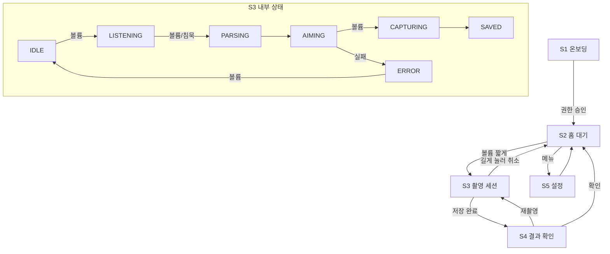

# Snap-Sight 화면 틀 설계 (#4)

> 담당: ⑤ 준서 · 화면을 보지 않는 사용자가 주 대상이므로 "보이는 UI"보다 **상태 전환과 낭독 순서**를 중심으로 설계한다.
> 비주얼 디자인(컬러·타이포)과 햅틱·사운드 패턴 상세는 범위 밖 (⑥ 담당).

## 1. 화면 목록

| # | 화면 | 목적 | 진입 경로 |
|---|---|---|---|
| S1 | 온보딩 | 첫 실행 시 권한(카메라·마이크) 요청, 볼륨 버튼 사용법 낭독 | 최초 실행 1회 |
| S2 | 홈(대기) | 세션 시작 대기. 볼륨 버튼 안내 낭독 | 앱 실행 시 기본 |
| S3 | 촬영 세션 | 트리거→발화→조준→셔터→저장의 전 과정 | S2에서 볼륨 버튼 |
| S4 | 결과 확인 | 촬영 결과 낭독(MLLM 설명), 재촬영/공유 선택 | S3 저장 완료 후 자동 |
| S5 | 설정 | 피드백 방식(진동/사운드 강도), 음성 속도 등 | S2에서 메뉴 |

## 2. 촬영 세션(S3) 상태 정의

README 파이프라인 단계와 1:1 대응한다.

| 상태 | 파이프라인 단계 | 화면 표시 | 볼륨 버튼 동작 | 피드백 자리 (⑥) |
|---|---|---|---|---|
| IDLE | (세션 전) | "볼륨 버튼을 눌러 시작" | **짧게: 세션 시작** | 음성: 시작 안내 1회 |
| LISTENING | 2. 의도 발화 | "무엇을 찍을까요?" + 녹음 표시 | 짧게: 발화 종료 | 사운드: 녹음 시작/종료 비프 |
| PARSING | 3. 의도 파싱 | "알아듣는 중…" | 무시 | 사운드: 처리 중 루프 |
| AIMING | 4~5. 조준 루프 | 미리보기 + 편차 표시(시각 보조) | **짧게: 셔터** | 햅틱+사운드: 편차 연속 신호 / 음성: 큰 이벤트 1회 |
| CAPTURING | 6~7. 셔터·버퍼 | "촬영!" | 무시 | 햅틱: 셔터 확정 진동 + 셔터음 |
| SAVED | 7. 저장 완료 | "저장 완료" | 무시 (S4로 자동 전환) | 음성: 저장 완료 안내 |
| ERROR | (모든 단계) | 실패 사유 | 짧게: IDLE 복귀 | 음성: 사유 설명 (TTS) |

- 길게 누름(시스템 onKeyLongPress, 약 1초)은 모든 상태에서 **세션 취소 → IDLE** 로 동작한다 (구현 완료).
- PARSING 은 구현 완료: SpeechRecognizer 인식 → 백엔드 NLU 로 TargetSpec 수신.
  인식 콜백 무응답 대비 8초 타임아웃 — 초과 시 스펙 없이 AIMING 진행.
- SAVED 이후 백엔드 MLLM 비교 결과를 폴링(총 45초 제한)해 개선 여부를 음성 안내한다.
  S4 결과 화면(⑥)이 붙기 전까지는 이 음성 안내가 S4 역할을 대신한다.
  상세는 `docs/frontend-capture-module.md` 참고.

## 3. 화면 이동 경로

## 4. 화면별 접근성 요소

공통 원칙
- 터치 영역 최소 **48dp × 48dp** (Android 접근성 가이드)
- 모든 조작은 **볼륨 버튼만으로 완결** 가능해야 함. 터치는 보조 수단
- 화면 요소에는 전부 `contentDescription` 부여, 장식 요소는 낭독 제외
- 상태 전환 시 `announceForAccessibility` 로 즉시 낭독 (TalkBack 미사용자도 자체 TTS 동작)

| 화면 | TalkBack 낭독 순서 | 비고 |
|---|---|---|
| S1 온보딩 | 앱 소개 → 볼륨 버튼 사용법 → 권한 요청 버튼 | 권한 거부 시 재안내 경로 필수 |
| S2 홈 | 현재 상태("대기 중") → 시작 방법 안내 → 설정 버튼 | 첫 포커스는 상태 텍스트 |
| S3 세션 | 상태 텍스트 → (조준 중) 편차 안내 → 취소 버튼 | 연속 신호는 낭독이 아닌 사운드/햅틱 |
| S4 결과 | 저장 결과 → 사진 설명(MLLM) → 재촬영 → 확인 | 사진 설명이 첫 포커스 |
| S5 설정 | 항목 순서대로. 각 항목은 현재값 포함 낭독 | 슬라이더는 볼륨 버튼으로도 조절 |

## 5. 후속 구현 Issue 후보

- [x] 세션 상태 머신 + 볼륨 트리거 구현 (⑤)
- [x] 프레임 링 버퍼(전후 1초) + 백엔드 업로드 클라이언트 (⑤)
- [x] IMU 기울기 센서 연동 (⑤)
- [x] 편차 계산·촬영 적기 판정 + 자동 줌 (⑤ — 임계값은 `docs/ux/guidance-state-schema.md`)
- [x] MLLM 비교 결과 폴링 + 음성 안내 (⑤)
- [x] 온보딩·설정 화면 및 TalkBack 대응 (⑥)
- [ ] 편차 신호 → 방향 인코딩 햅틱·사운드 패턴 (⑥)
- [ ] 결과 확인 화면(S4) + MLLM 설명 낭독 (⑥, ④ 연동)

## 6. 쟁점 기록

- ~~롤링 프레임 버퍼 보유 주체 (④ vs ⑤)~~ → `backend/api/capture.py` 구현 기준 **⑤(Android 로컬 버퍼)** 로 정리됨. 촬영 시점에 대표 컷+후보를 업로드.
- 화면 잠금 상태 트리거(접근성 서비스/포그라운드 서비스)는 난이도가 높아 MVP 이후로 미룸.

## 7. Figma

- 와이어프레임 링크: (작성 후 Issue #4에 첨부 예정)
