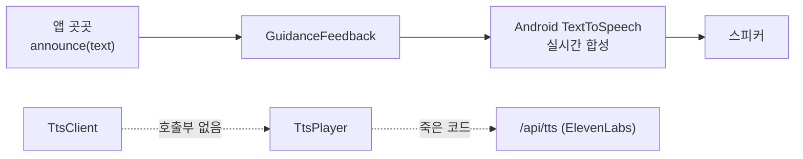
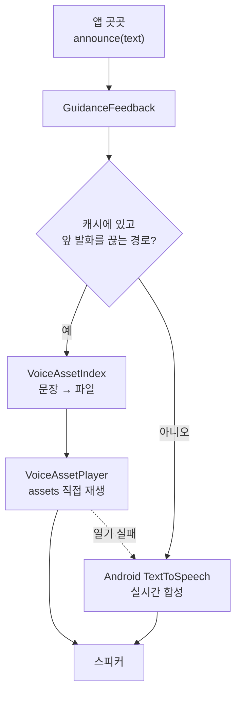
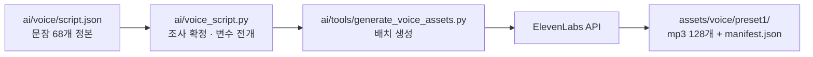

# 안내 음성 프리캐싱 아키텍처

이슈 #87 로 들어온 변경의 구조와 근거를 정리한다. 안내 문구를 정본으로 고정하고 음원을 미리 구워, 기기와 무관하게 같은 목소리로 오프라인에서도 안내하는 것이 목표다.

## 왜 바꿨나

기획("스크립트 - 준서" 부록 1, "최종 기획 정리" 프레이밍 조정 기준)이 정한 전제는 하나다.

> 네비가 매끄러운 이유: 미리 만들어둔 걸 재생. 같은 패턴 반복 — 뇌가 문장을 파싱하지 않고 신호로 처리.

변경 전 앱은 모든 안내를 Android 내장 `TextToSpeech`로 **매번 실시간 합성**했다. 그래서 세 가지 문제가 있었다.

| 문제 | 결과 |
|---|---|
| 목소리가 기기의 TTS 엔진에 종속 | 같은 앱인데 폰마다 다른 목소리 |
| 억양·속도가 호출마다 미묘하게 다름 | 반복 안내가 "신호"로 굳지 않음 |
| 합성 지연이 매번 발생 | 조준 중 안내가 늦게 나옴 |

## 시스템 구조 변화

### 변경 전



`TtsClient`와 `TtsPlayer`는 정의만 되어 있고 **어디서도 호출되지 않는 죽은 코드**였다. 백엔드 `/api/tts` 엔드포인트도 앱에서 쓰이지 않았다.

### 변경 후



**핵심 설계 결정 세 가지.**

1. **연결 지점은 `announce()` 한 곳.** 앱의 모든 발화가 여기를 지나가므로, 호출부 100여 곳은 한 줄도 바뀌지 않았다.
2. **음원을 id 가 아니라 문장 텍스트로 찾는다.** 호출부는 `announce("촬영할게요.")`처럼 문장만 알지 음원 id를 모른다. 색인이 문장으로 맞춰 붙인다.
3. **폴백이 항상 살아 있다.** 음원이 없거나 못 열면 시스템 TTS로 되돌아간다. manifest가 통째로 없어도 앱은 정상 동작한다 — TFLite 모델 자산과 같은 원칙이다.

### 생성 파이프라인



문장 68개가 음원 128개가 되는 이유는 변수 전개다.

```
고정 문장            51
{피사체} 6문장 × 10종  60
{방향}   1문장 × 4종    4
                    ───
                    115  → 최종 기획 정리 반영 후 128
```

## AI 모듈 변화

**탐지 모델은 바뀌지 않았다.** `objects365_yolo26_v1.tflite`, `face_embedder.tflite`, ByteTrack 트래커, `SpecDeviationCalculator` 모두 그대로다. 이번 변경은 **음성 출력 경로**만 건드린다.

`ai/` 아래에 추가된 것은 모델이 아니라 **문장 정본과 그 도구**다.

| 추가 | 성격 |
|---|---|
| `ai/voice/script.json` | 데이터 (문장 정본) |
| `ai/voice_script.py` | 로더·전개기 |
| `ai/tools/generate_voice_assets.py` | 배치 도구 |

기존 `ai/taxonomy/photo_labels.json` + `ai/photo_labels.py` 와 같은 패턴이다 — 정본 JSON 하나에 로더 하나, Android 는 assets 로 복사된 산출물을 읽는다.

### TTS 엔진 위치

| 용도 | 엔진 | 시점 |
|---|---|---|
| 고정 안내 문구 128개 | ElevenLabs → mp3 | **빌드 전 1회** (오프라인 재생) |
| 결과 설명 (사진 묘사) | Claude → 텍스트 → 시스템 TTS | 촬영 후 실시간 |
| 설정 확인 낭독 | 시스템 TTS | 즉시 |

기획이 "실시간 합성 대상은 단 2개"라고 한 것과 같은 구조다. 조합이 폭발하는 문장(설정 확인 낭독의 `{항목}×{값}`)은 프리캐싱하지 않는다.

**NUGU SDK 는 이 경로에 넣을 수 없다.** NUGU TTS 는 클라우드 directive 방식이라 임의 텍스트를 음원 파일로 받아오는 API 가 없다. 런타임 `TTSAgent.requestTTS()` 는 있으나 매 문장 네트워크 왕복이 필요해, 오프라인에서 안내가 나와야 한다는 요구와 충돌한다. (2026-08-23 기준 GitHub 저장소 404, Maven 저장소 401 로 SDK 확보 자체가 막혀 있다.)

## 까다로웠던 지점

### 한국어 조사

기획 문서는 `"{피사체}를 찾았어요"`처럼 조사를 고정해 뒀다. 그대로 치환하면 비문이 나온다.

```
사람  + 를  →  사람를 찾았어요     ✗
사람  + 을  →  사람을 찾았어요     ✓
강아지 + 를  →  강아지를 찾았어요   ✓
```

정본은 `{을/를}` 마커로 두고, 앞 단어 마지막 글자의 **종성 유무**를 계산해 확정한다. `{이/가}`, `{은/는}`, `{과/와}`, `{으로/로}`도 같다. `{으로/로}`는 ㄹ 받침 예외까지 처리한다(`서울로`).

같은 문제가 설정 확인 낭독에도 있어서(`강조 + 으로 = 강조으로`) Kotlin 쪽 `MainActivity.euroRo()` 에도 같은 규칙을 넣었다.

### 스레드

`announce()` 는 CV 분석 스레드에서도 호출된다. `TextToSpeech`·`Vibrator`·`ToneGenerator` 는 스레드 안전해서 기존 코드가 직접 호출했지만, **`MediaPlayer` 는 그렇지 않다.** 재생만 메인 스레드로 넘긴다.

### 큐잉

캐시 음원은 **앞 발화를 끊는 경로(`QUEUE_FLUSH`)에서만** 쓴다. 뒤에 붙여야 하는 `QUEUE_ADD` 는 시스템 TTS 에 맡긴다 — 재생기가 한 번에 하나만 재생하므로 큐를 흉내 내면 앞 안내를 잘라먹는다. READY 안내가 잘리는 것보다 목소리가 섞이는 편이 낫다고 판단했다.

완료 콜백 계약(끝나든 끊기든 반드시 한 번)은 두 경로가 `completeUtterance()` 를 공유해 동일하다. 이 계약이 깨지면 발화 완료를 기다리는 **마이크 게이트가 영영 안 열린다.**

## 남은 격차

- **캐시 적중률이 낮다.** 정본 문장과 코드에 하드코딩된 문구가 상당수 다르다. 코드가 탭 문법·얼굴 등록·사진 검색 쪽으로 확장되는 동안 문서는 음성 명령 기준으로 남아 있었다. 문구를 정본으로 수렴시키는 작업이 필요하다.
- **프리셋 2·3 음원 미생성.** 구조와 생성기는 준비됐고 목소리 ID 2개만 있으면 된다.
- **격자 색.** 기획은 노랑 `#FFD400`, 구현은 흰색(+검정 외곽선 1dp). 저시력 대비 확보가 원래 목적이므로 복지관 테스트에서 재확인할 항목이다.
- **채널 최소 보장** 규칙(안내 음성·사운드·진동을 모두 끌 수 없음)은 문구만 있고 강제 로직이 없다.
- **자동 촬영 카운트다운**("셋/둘/하나")은 음원만 있고 호출 로직이 없다.

## 관련 문서

- `docs/ux/feedback-mapping.md` — 상태별 피드백 매핑
- `docs/ux/talkback-behavior.md` — TalkBack 동작
- `docs/ux/guidance-state-schema.md` — GuidanceState 필드·임계값
